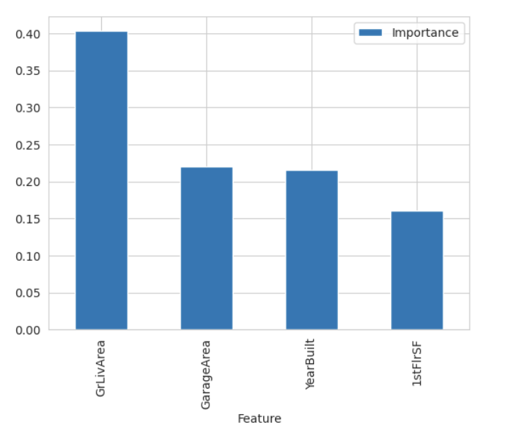
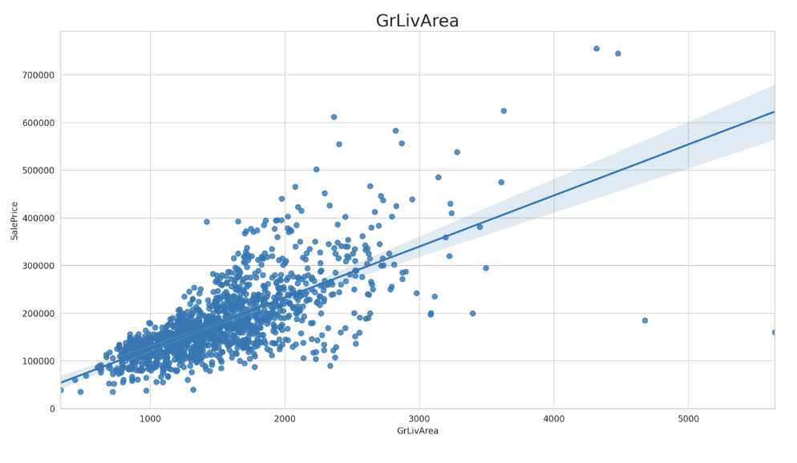
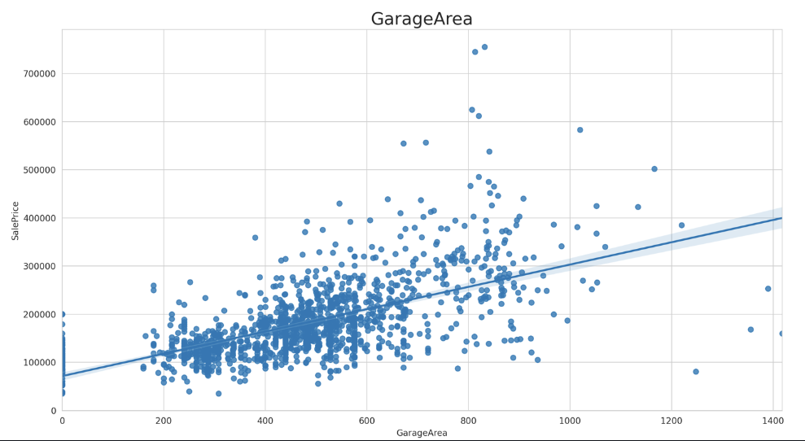
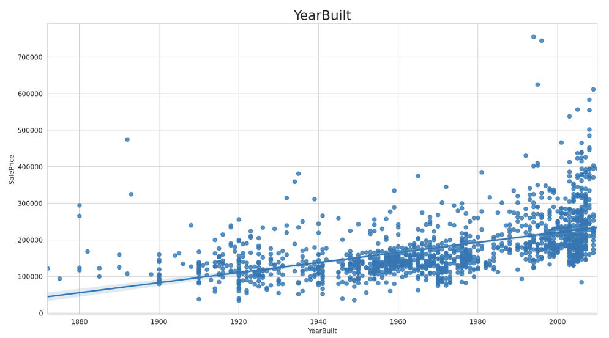
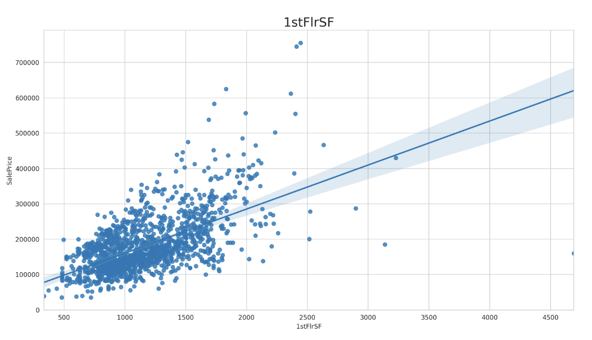
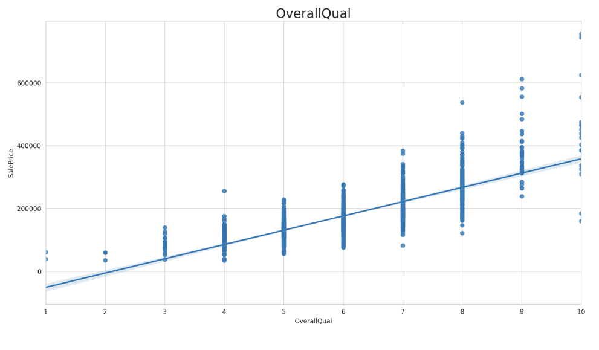
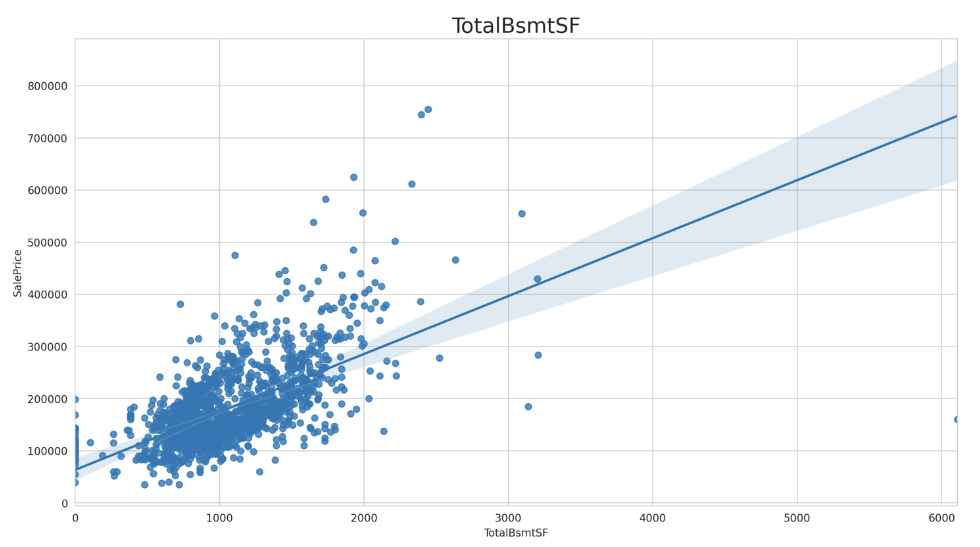
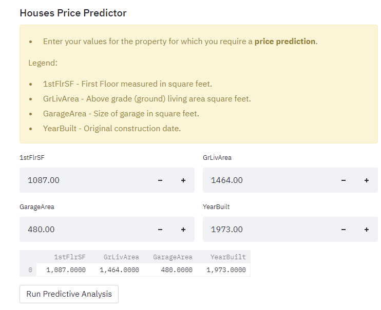
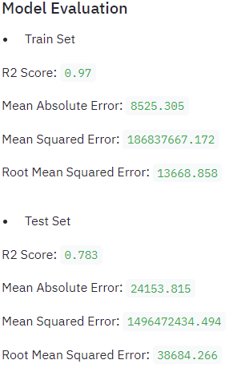
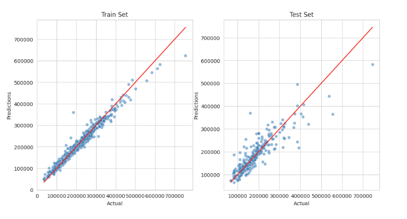

# House Pricing (PP5)

This project is part of the Full Stack Developer course provided by Code Institute, specifically the Predictive Analytics path. It is the final milestone project of the course, focusing on working with data.

The project aims to provide a step-by-step walkthrough of the entire process, from data cleaning to feature engineering. The content has been personalized to offer a welcoming experience and a comprehensive understanding of each step and its implementation.

**Live Application:** [House Price Predictor](https://project-5-predictive-analytics.herokuapp.com/)

## Dataset

The dataset used in this project is sourced from [Kaggle](https://www.kaggle.com/). Kaggle is an online community platform for data scientists and machine learning enthusiasts that offers collaboration, dataset publishing, GPU integrated notebooks, and data science challenges.

The dataset, found on Kaggle under the Code Institute account, consists of 1,460 rows (including variable names) representing housing records from Ames, Iowa, USA. It includes various house profiles, such as floor areas, basements, garages, kitchens, lots, porches, wood decks, and the year built, among others. The dataset covers houses built between 1872 and 2010, along with their respective sale prices.

To help you understand the analysis performed in the project, refer to the table below, which provides explanations and units for each variable used:

---

| Variable      | Meaning                                     | Units                           |
|:--------------|:--------------------------------------------|:--------------------------------|
| 1stFlrSF      | First Floor square feet                      | 334 - 4,692 sq. ft.             |
| 2ndFlrSF      | Second floor square feet                     | 0 - 2,065 sq. ft.               |
| BedroomAbvGr  | Bedrooms above grade (excludes basement)     | 0 - 8 bedrooms                  |
| BsmtExposure  | Refers to walkout or garden level walls       | Gd: Good, Av: Average, Mn: Minimum, No: No Exposure, None: No Basement |
| BsmtFinType1  | Rating of basement finished area             | GLQ: Good Living Quarters, ALQ: Average Living Quarters, BLQ: Below Average Living Quarters, Rec: Average Rec Room, LwQ: Low Quality, Unf: Unfinished, None: No Basement |
| BsmtFinSF1    | Type 1 finished square feet                  | 0 - 5,644 sq. ft.               |
| BsmtUnfSF     | Unfinished square feet of basement area       | 0 - 2,336 sq. ft.               |
| TotalBsmtSF   | Total square feet of basement area            | 0 - 6,110 sq. ft.               |
| GarageArea    | Size of garage in square feet                 | 0 - 1,418 sq. ft.               |
| GarageFinish  | Interior finish of the garage                 | Fin: Finished, RFn: Rough Finished, Unf: Unfinished, None: No Garage |
| GarageYrBlt   | Year garage was built                         | 1900 - 2010                     |
| GrLivArea     | Above grade (ground) living area square feet  | 334 - 5,642 sq. ft.             |
| KitchenQual   | Kitchen quality                              | Ex: Excellent, Gd: Good, TA: Typical/Average, Fa: Fair, Po: Poor |
| LotArea       | Lot size in square feet                       | 1,300 - 215,245 sq. ft.         |
| LotFrontage   | Linear feet of street connected to property   | 21 - 313 linear ft.             |
| MasVnrArea    | Masonry veneer area in square feet            | 0 - 1,600 sq. ft.               |
| EnclosedPorch | Enclosed porch area in square feet            | 0 - 286 sq. ft.                 |
| OpenPorchSF   | Open porch area in square feet                | 0 - 547 sq. ft.                 |
| OverallCond   | Rates the overall condition of the house      | 10: Very Excellent, 1: Very Poor |
| OverallQual   | Rates the overall material and finish of the house | 10: Very Excellent, 1: Very Poor |
| WoodDeckSF    | Wood deck area in square feet                 | 0 - 736 sq. ft.                 |
| YearBuilt     | Original construction date                    | 1872 - 2010                     |
| YearRemodAdd  | Remodel date (same as construction date if no remodeling or additions) | 1950 - 2010 |
| SalePrice     | Sale Price                                   | $34,900 - $755,000              |

---

## CRISP-DM: A Comprehensive Data Science Process

CRISP-DM, which stands for Cross Industry Standard Process for Data Mining, is a well-known process model that serves as the foundation for data science projects.

The CRISP-DM model consists of six sequential phases:

1. Business Understanding: Understand the objectives and requirements of the business.
2. Data Understanding: Gain insights into the available data and assess its quality and relevance.
3. Data Preparation: Organize and preprocess the data to make it suitable for modeling.
4. Modeling: Apply appropriate modeling techniques to extract insights and patterns from the data.
5. Evaluation: Evaluate the performance of different models and select the one that best meets the business's objectives.
6. Deployment: Deploy the chosen model and make it accessible to relevant stakeholders.

---

## Business Requirements.

I am currently enrolled in the Full Stack Developer course offered by Code Institute. Throughout the course, I have gained knowledge and practical experience in various areas, including Machine Learning. This valuable skillset will greatly benefit me in my current career as a Senior Business Analyst.

Recently, a friend of mine, who resides in the United States, embarked on a venture in the real estate industry. Her vision entails purchasing six houses located in Ames, a small town in Iowa. With its strong and stable economy, coupled with a vibrant cultural environment and a population of over 89,540 residents, my friend firmly believes that investing in this area will yield significant returns. Her plan involves acquiring older properties, renovating them, and subsequently selling them at higher prices.

Although my friend possesses a solid understanding of the average house prices in this region, she recognizes the importance of accurate predictions to ensure the success of his investment. Consequently, he approached me, knowing that I possess expertise in machine learning. By leveraging the power of this technology, I can provide him with precise price predictions for each of the refurbished houses, eliminating the risk of unreliable appraisals.

To facilitate this task, my friend has conducted extensive research and identified a publicly available dataset containing historical records of sold houses. He will share this dataset with me, enabling me to create a robust prediction model that aligns with her business goals.

---

## Hypothesis and Validation

1. Hypothesis One:
   - Assumption: The price of houses is positively correlated with their surface area measured in square feet.
   - Validation Approach: Perform a correlation study to examine the relationship between house prices and surface area.

2. Hypothesis Two:
   - Assumption: Houses with the same usable surface area but built more recently have a higher price than older-built homes.
   - Validation Approach: Conduct a correlation study to investigate the relationship between house prices and the year they were built.

3. Hypothesis Three:
   - Assumption: Houses with the same usable surface area, built in a recent year, but remodeled recently, have a higher price compared to houses built in the same year but not remodeled.
   - Validation Approach: Perform a correlation study to analyze the relationship between house prices and remodeling status.

4. Hypothesis Four:
   - Assumption: Houses with similar surface area but higher quality materials and condition scores tend to have a higher sales price.
   - Validation Approach: Conduct a correlation study to assess the relationship between house prices and material/condition scores.

---

## Rationale to map the business requirements to the Data Visualizations and ML tasks

List the business requirements and rationale to map them to the data visualizations and ML tasks.

---

### Business Requirement 1 – Data Visualization and Correlation Study

- As a data analyst, I need to visualize the data related to the house records to understand how each attribute influences the sale price.
- Conduct a correlation study (Pearson and Spearman) to determine the correlation between variables and the sale price.
	- Perform correlation and/or PPS studies to investigate the most relevant variables correlated to the sale price.
- Plot the main variables against the sale price to visualize insights on how the house attributes correlate with the sale price.
- Summarize the insights obtained from visualizing these variables against the sale price.

## Outcome after predicting pricing

After conducting our study, we realized that the features that impact the price are:

We can take a closer look at each:

- GrLivArea (Above grade (ground) living area square feet)
  

- GarageArea (Size of garage in square feet)
  

- YearBuilt (Original construction date)
  

- 1stFlrSF (First Floor square feet)
  

- OverallQual (Rates the overall material and finish of the house)
  

- TotalBsmtSF (Total square feet of basement area)
  

For more details, please refer to the live app linked at the top of the readme/deployment.

### Business Requirement 2

- As a data analyst, I need to predict the sale price of the houses.
- Build an ML model to predict the house prices for the 6 newly refurbished houses my friend plans to sell.
- Ensure that the ML system can reliably predict the summed sale price of the 6 houses.
- Use either conventional ML or Neural Networks to establish the relationships between the features and the target variable.
- Consider changing the ML task from regression to classification if a valid rationale exists.
- If using conventional ML with libraries like scikit-learn, perform extensive hyperparameter optimization for the chosen algorithm.

## Outcome after price prediction.

- My friend wanted to find out what are the prices for the houses. 

- In the feature he could use the added tool to be able to predict pricing for houses by imputing his own inputs.This can be located on the deployed site.

---

## ML Business Case

### Business Case Assessment

1. **What are the business requirements?**

### Business Requirement 1:

- The primary objective is to analyze the correlation between house attributes and sale prices.
- It is important to visualize the correlation variables in relation to the sale price.
- The ability to predict the prices of newly refurbished houses and potential future house purchases is also desired.

2. **Can the above business requirements be addressed with conventional data analysis?**

- Yes, conventional data analysis techniques can be used to investigate the correlation between house attributes and sale prices.

3. **Does the project require a dashboard or an API endpoint?**

- To provide the best assistance to my friend, I want to develop a project that can be revisited and reused in the future.

4. **What would define a successful outcome for the project?**

- A successful outcome would include a comprehensive study highlighting the most relevant variables correlated to the sale price.
- The ability to predict the prices of other houses in the region, including the 6 newly refurbished houses, is also important.

5. **As a data analyst, I would like to break down the project into epics and user stories.**

- Data gathering from a public source and initial data collection: [DataCollection.ipynb]
- Data visualization, cleaning, and preparation: [SalePriceStudy.ipynb]
- Model training, optimization, and validation: [FeatureEngineering.ipynb]
- Dashboard planning, design, and development
- Dashboard deployment and release

6. **Are there any ethical or privacy concerns?**

- Since the dataset is obtained from a public source, there are no ethical or privacy concerns.

7. **Does the data suggest a particular model?**

- The data suggests the use of a regression model, where the target variable is the sale price.

8. **What are the model inputs and intended outputs?**

- The sale price is influenced by the house attribute information provided above, and the intended output is the predicted sale price.

9. **What are the criteria for the performance goal of the predictions?**

- My friend and I have agreed that achieving an R2 score of at least 0.75 on both the training and test sets would be considered ideal.

10. **How would my friend benefit from this project?**

- My friend will be able to maximize the sale prices of the newly refurbished houses.
- Additionally, he can leverage the project in the future to sell other houses through his small real estate agency.

### Outcome after price prediction:

- After the completion of this project, we were able to achieve the agreed-upon R2 score with my friend, which was initially set to be above 0.75.

- The training and test sets were conducted in a way that they closely match each other.

---

## Dashboard Design

### Dashboard Expectations

The dashboard should include:

Page 1: Quick project summary

- A summary of the project dataset
- Business requirements and my friend's project requirements
- Dataset content guidelines

Page 2: House Sale Price Study

- Addressing business requirement 1
- Data inspection of the housing sale dataset
- Displaying the number of rows and columns in the data
- Showing the first ten rows of the data
- Displaying variables with the strongest correlation to the sale price and drawing conclusions
- Individual plots showing the correlation between the sale price and each variable

Page 3: Price Predictor

- Addressing business requirement 2
- Listing the details of my friend's houses and his predicted sale prices
- Displaying the total sum of the predicted house sale prices
- Providing interactive input and widgets for real-time house data to predict the sale price
- A "Run predictive analysis" button to generate predictions based on the provided house data

Page 4: Project Hypothesis and Validation

- Describing each project hypothesis, its conclusion, and the validation method

Page 5: ML: House Sale Price Prediction

- Considerations and conclusions after training the ML pipeline
- Displaying the ML pipeline steps
- Listing the feature importance and plotting the best features
- Evaluating the pipeline's performance and displaying relevant plots

---

## Python Code Testing

- The python code was tested using "python3 -m flake8 app_pages" in the GitPod terminal.
- The flake8 tool was used, as the pep8 page was deactivated.

## Deployment

The master branch of this repository was used for the deployed version of the application.

### Using GitHub & Gitpod

To deploy the Data application, I followed these steps:

- I used the Code Institute Full Template by clicking the "Use This Template" button.
- I added a repository name and description.
- I created the repository from the template, which created a Gitpod workspace.
- I committed my work often with clear messages using the commands:
  - `git add .` to add all modified files to the staging area
  - `git commit -m "A message explaining the commit"` to commit the changes to the local repository
  - `git push` to push the committed changes to the GitHub repository

### Forking the GitHub Repository

To fork the GitHub repository, follow these steps:

1. Log in to GitHub and locate the GitHub repository.
2. Click the "Fork" button at the top of the repository page.
3. You will now have a copy of the original repository in your GitHub account.

### Making a Local Clone

To make a local clone of the GitHub repository, follow these steps:

1. Log in to GitHub and locate the GitHub repository.
2. Click the "Clone or download" button.
3. Copy the repository's URL under "Clone with HTTPS".
4. Open the command line interface on your computer.
5. Change the current working directory to the location where you want to clone the repository.
6. Use the command `git clone` followed by the URL you copied in step 3.

$ git clone [repository URL]

## Deployment To Heroku

- The App live link is: [HERE!](https://project-5-predictive-analytics.herokuapp.com/)
- The project was deployed to Heroku using the following steps.
1. Log in to Heroku and create an App
2. At the Deploy tab, select GitHub as the deployment method.
3. Select your repository name and click Search. Once it is found, click Connect.
4. Select the branch you want to deploy, then click Deploy Branch.
5. The deployment process should happen smoothly in case all deployment files are fully functional. Click now the button Open App on the top of the page to access your App.
7. Press Enter to create your local clone.

---
## Conclusion

- Dataset Acquisition: The project required a dataset, which was obtained from Kaggle. The dataset was carefully selected, used, and cleaned to ensure its suitability for the project.
- Variable Table: Each variable has been organized into a comprehensive table, detailing their meanings and the units of measurement associated with each variable. The table can be found in the readme file.
- Business Requirements: The project's business requirements were developed using the CRISP-DM model. The primary objective was to assist my niece's business in accurately predicting housing prices.
- Streamlit Dashboard: A user-friendly dashboard was created using Streamlit, allowing all relevant project details to be presented to stakeholders, particularly my niece. The dashboard was designed to be easily understandable even for individuals without a deep understanding of machine learning.
- Deployment on Heroku: The project has been successfully deployed on Heroku. Please refer to the above steps for instructions on deployment.

Overall, the project can be deemed a success as all the requirements have been fulfilled, and my friend is satisfied with the predicted prices. However, considering the impact of inflation, it was determined that a 10.5% increase should be added to the house prices. It's important to note that this percentage may vary depending on future changes in inflation rates.

---

## Credits & Content Used

- Project Content: The project's content draws from the knowledge gained through walk-through projects provided by Code Institute. While there may be similarities to the content of the "Churnometer" walk-through project, it has been adapted and modified accordingly.
- Bug Fixing & Issue Resolution: During the project, various bugs and issues arose, which were resolved with the help of resources like Stack Overflow, ChatGPT.
- Readme File: The readme file was created using the Code Institute template, providing a structured and organized format.
- Inspiration: Certain elements presented in the project and readme file were inspired from this [repository!](https://github.com/Vasi012/PP5-Predictive-Analysis).
- Mentor Guidance: I would like to express my gratitude to my mentors, who provided guidance throughout the project, ensuring the implementation of best practices.

## Acknowledgements

I would like to extend my heartfelt appreciation to Code Institute for offering this exceptional course. The learning experience has been truly enjoyable and has transformed my perspective from considering coding as mere gibberish to actually understanding and working with it. I am immensely grateful to both my mentors, Harry and Mo Shami, for their continuous support throughout the course.

---

